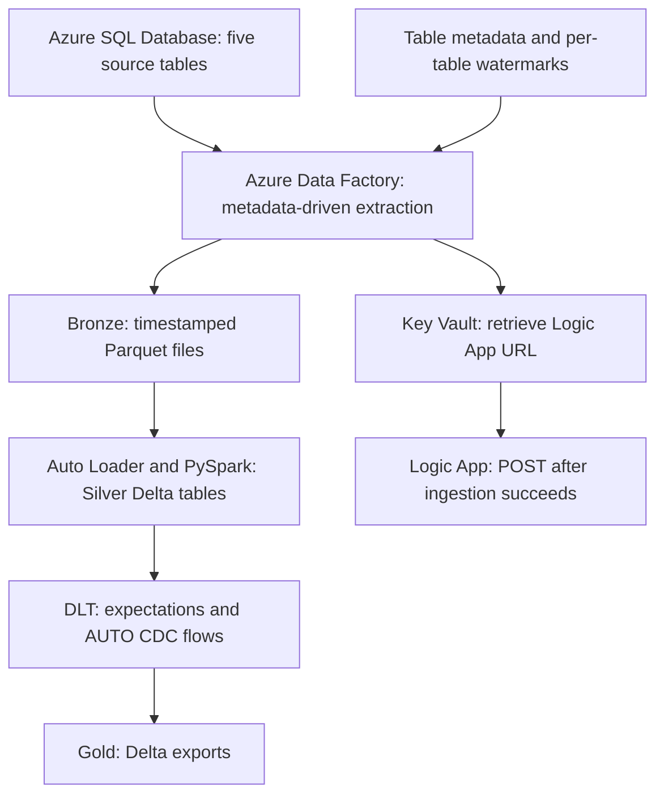

# Spotify Azure Lakehouse

An Azure data engineering project that processes Spotify-style music and listening data through a Bronze, Silver, and Gold lakehouse. Azure Data Factory extracts records from Azure SQL Database, Databricks Auto Loader ingests landed files, and Delta Live Tables (DLT / Lakeflow pipelines) applies data quality expectations and maintains record history.

The project uses SQL seed data supplied in this repository. Its ingestion source is Azure SQL Database; a Spotify Web API connector is not included.

## Architecture



ADF handles ingestion and its success notification. The Databricks stages are separate execution steps in the checked-in implementation.

## Technology Stack

| Technology | Role |
| --- | --- |
| Azure SQL Database | Relational source tables and sample data |
| Azure Data Factory | Metadata lookup, incremental copy, BackDate reloads, and watermark persistence |
| ADLS Gen2 | Bronze Parquet files, Silver Delta data and checkpoints, and Gold Delta exports |
| Azure Databricks / PySpark | File ingestion and transformations |
| Auto Loader | Incremental discovery of Bronze Parquet files |
| Delta Lake | Table storage for Silver, pipeline outputs, and Gold |
| DLT / Lakeflow pipelines | Expectations, streaming staging tables, and AUTO CDC processing |
| Unity Catalog | Catalog and schema references for Databricks tables |
| Azure Key Vault / Managed Identity | ADF retrieves the Logic App endpoint from a secret |
| Azure Logic Apps | Receives pipeline name and run ID after successful ingestion |
| Databricks bundles | Development and production target configuration and pipeline resource definitions |

## Data Model

The source model contains four dimensions and one listening-event fact table.

| Table | Key | Main attributes | ADF watermark |
| --- | --- | --- | --- |
| `DimArtist` | `artist_id` | Artist name, genre, country | `updated_at` |
| `DimUser` | `user_id` | User name, country, subscription type | `updated_at` |
| `DimTrack` | `track_id` | Track name, artist, album, duration, release date | `updated_at` |
| `DimDate` | `date_key` | Date, day, month, year, weekday | `date` |
| `FactStream` | `stream_id` | User, track, date, listening duration, device | `stream_timestamp` |

`FactStream` links logically to users, tracks, and dates; tracks link to artists. The source DDL defines primary keys but does not declare these relationships as foreign-key constraints.

## Pipeline Walkthrough

### 1. Metadata-driven Bronze ingestion

The ADF pipeline, `meta-data driven increamental loading`, reads `tablesdata.json` and processes its entries through a sequential `ForEach` activity.

For each table, the pipeline:

1. Reads the previously saved `lastload` value.
2. Queries the maximum source watermark as `latestload`.
3. Captures a timestamp for the output filename.
4. Copies qualifying SQL records into a table-specific Bronze folder as Snappy-compressed Parquet.
5. Writes the captured `latestload` to the watermark file when records were read; otherwise, invokes the empty-output deletion branch.

The extraction predicate selects records strictly after either the saved watermark or the optional BackDate value:

```sql
SELECT *
FROM @{item().schema}.@{item().table}
WHERE @{item().column} > '@{if(empty(coalesce(item().backdate, '')), activity('lastload').output.firstRow.lastload, item().backdate)}'
```

The initial watermark template is `1900-01-01`. Updates to artist, user, and track records must advance `updated_at` to be eligible for a normal incremental extraction. SQL deletes are not captured by this timestamp-based query.

### 2. BackDate reloads

Each metadata entry supports a `backdate` override:

```json
{
  "schema": "dbo",
  "table": "DimArtist",
  "column": "updated_at",
  "backdate": "2025-09-01 00:00:00"
}
```

A nonempty BackDate replaces the lower extraction boundary for that table. This re-extracts currently available source rows after the supplied timestamp; it does not reconstruct historical SQL snapshots. Restore `backdate` to an empty string after the replay. Replayed records require deliberate duplicate handling downstream.

### 3. Silver ingestion and transformation

`silverLayer.ipynb` reads each Bronze table folder with Auto Loader using `cloudFiles.format = parquet`. It writes Delta tables under `silvecatalog.silverschema`, with table-specific schema/checkpoint locations and `trigger(once=True)`.

| Dataset | Checked-in transformation |
| --- | --- |
| Artist | Removes `_rescued_data`; artist-key deduplication is commented out |
| Date | Removes `_rescued_data` and deduplicates on `date_key` |
| Track | Replaces hyphens in track names, creates a duration category, removes `_rescued_data`, and deduplicates on `track_id` |
| User | Removes `_rescued_data` and deduplicates on `user_id` |
| Stream | Removes `_rescued_data` and deduplicates on `stream_id` |

Track duration categories are stored in `updated_flag`: `short_track` for durations below 150 seconds, `medium_track` for 150–249 seconds, and `long_track` otherwise.

### 4. Data quality and history processing

The five DLT Python files define staging tables, apply `expect_all_or_drop`, and configure AUTO CDC targets. Records failing the configured null checks are dropped from staging.

| Output | Required non-null fields | Sequence column | History mode |
| --- | --- | --- | --- |
| `dimartist_streaming` | `artist_id`, `artist_name` | `updated_at` | SCD Type 2 |
| `dimuser_streaming` | `user_id`, `user_name` | `updated_at` | SCD Type 2 |
| `dimtrack_streaming` | `track_id`, `track_name` | `updated_at` | SCD Type 2 |
| `dimdate_streaming` | `date_key`, `date` | `date` | SCD Type 2 |
| `factstream_streaming` | `stream_id` | `stream_timestamp` | SCD Type 1 |

Type 2 targets are configured to retain versions by business key; the Type 1 fact target maintains the latest record per stream key. These behaviors depend on the corresponding change records reaching staging with suitable sequence values.

Row tracking is enabled on staging and target tables. It is separate from change data feed: the checked-in staging definitions use ordinary Delta streaming reads and do not enable `readChangeFeed` or supply delete-event handling.

### 5. Gold export

`goldLayer.ipynb` reads the five `*_streaming` tables and appends their contents to Delta paths in the `gold` container. The dimension exports include available history, rather than filtering to current versions.

The dataset can support analysis of listening duration, popular tracks, artist engagement, subscriptions, and device usage. Dashboard files and business aggregation queries are not included.

## Repository Guide

Databricks project files currently reside in `.bundle/spotifyproject/dev/files/`. Paths below reflect the committed layout.

| Location | Contents |
| --- | --- |
| [AzureCode](AzureCode/) | ADF factory, datasets, linked services, pipeline, and publish configuration |
| [SourceFiles](SourceFiles/) | Initial and incremental SQL scripts, metadata, and watermark templates |
| [.bundle/spotifyproject/dev/files/databricks.yml](.bundle/spotifyproject/dev/files/databricks.yml) | Bundle targets |
| [.bundle/spotifyproject/dev/files/resources](.bundle/spotifyproject/dev/files/resources/) | Pipeline resource and sample job definitions |
| [.bundle/spotifyproject/dev/files/src/spotifyproject_etl/transformations/silver](.bundle/spotifyproject/dev/files/src/spotifyproject_etl/transformations/silver/) | Auto Loader notebook |
| [.bundle/spotifyproject/dev/files/src/spotifyproject_etl/transformations/gold/goldetlpipeline/transformations](.bundle/spotifyproject/dev/files/src/spotifyproject_etl/transformations/gold/goldetlpipeline/transformations/) | DLT staging and AUTO CDC definitions |
| [.bundle/spotifyproject/dev/files/src/spotifyproject_etl/transformations/gold/goldLayer.ipynb](.bundle/spotifyproject/dev/files/src/spotifyproject_etl/transformations/gold/goldLayer.ipynb) | Gold export notebook |
| [.bundle/spotifyproject/dev/files/src/spotifyproject_etl/utils](.bundle/spotifyproject/dev/files/src/spotifyproject_etl/utils/) | Reusable transformation helper |

## Setup and Execution

### Prerequisites

- An Azure SQL database, Azure Data Factory, and ADLS Gen2 account.
- An Azure Databricks workspace with access to the lake storage and permissions to create the required catalogs, schemas, and tables.
- A pipeline environment supporting the checked-in DLT AUTO CDC APIs.
- Azure Key Vault and a Logic App HTTP endpoint for the notification step.

Azure infrastructure must be provisioned separately. Replace environment-specific storage addresses, workspace settings, SQL connection details, catalog references, and deployment identities before running the project.

### 1. Prepare the source and metadata

Clone the repository:

```bash
git clone https://github.com/CodeWithDipak/Spotify-Azure-Lakehouse.git
cd Spotify-Azure-Lakehouse
```

Review and execute `SourceFiles/spotify_initial_load.sql` in a dedicated demonstration database. It drops and recreates the five named tables before inserting sample records.

Create `bronze`, `silver`, and `gold` containers. Upload the metadata and seed watermarks to the following intended locations:

| Blob path within `bronze` | Source |
| --- | --- |
| `lastload/tablesdata.json` | `SourceFiles/tablesdata.json` |
| `lastload/empty.json` | `SourceFiles/empy.json`, renamed to match the pipeline |
| `lastload/<TableName>/lastload.json` | A copy of `SourceFiles/lastload.json` for each of the five tables |

### 2. Configure ADF

Connect ADF Git integration to this repository with **Root folder `/AzureCode`**. Configure and test the SQL and ADLS linked services in your factory; existing encrypted credential references are environment-specific.

Before publishing, correct the dataset parameter values that place folder segments in `container`. The datasets map `container` directly to `fileSystem`, so use `bronze` as the container and place `rawdata/<TableName>` or `lastload/<TableName>` in `folder`.

For notifications, create the `logicappurl` secret in your Key Vault and grant ADF's managed identity permission to read it. Update the vault URL in the pipeline. Configure the receiving Logic App to accept `pipeline_name` and `pipeline_runID`; its workflow definition is not provided here. Use valid JSON with double-quoted keys and values for the POST body. Enable secure output/input on the activities that expose or consume the retrieved secret.

Validate, publish, and run the ingestion pipeline. Check copied rows, landed files, watermark updates, and the success-notification activities.

### 3. Run Databricks stages in order

1. Make the Databricks project directory available in the workspace, preserving the helper module's import structure.
2. Configure storage access and create or select the required catalog and schema. The source code uses `silvecatalog.silverschema` throughout; keep all references consistent if renaming it.
3. Run `silverLayer.ipynb` as a notebook task and wait for all its streaming writes to finish.
4. Create a DLT/Lakeflow pipeline containing the five Python files in `goldetlpipeline/transformations`. Select the output catalog/schema expected by the Gold notebook, and run the pipeline update.
5. Verify staging expectations and target contents before running `goldLayer.ipynb` once for an initial export.

Use separate notebook tasks for Silver and Gold and a pipeline task for DLT, with explicit success dependencies. The broad library glob in the checked-in pipeline resource should be narrowed to the declarative DLT files; the ingestion and export notebooks perform imperative writes.

### 4. Exercise an incremental load

Insert a new source record, or update an artist with an `updated_at` value greater than the saved watermark. Run ADF, Silver, and DLT in that order. Inspect the updated key in the target, including its history where applicable.

Review `spotify_incremental_load.sql` before executing it: it includes inserts for keys already present in the initial script, and some timestamps may precede existing watermarks. Adapt it to the intended test scenario rather than running it blindly against the seeded database.

## Operational Notes

| Area | Current behavior and consideration |
| --- | --- |
| Silver update propagation | Stateful key-only deduplication on user and track streams can suppress later versions of an existing key. Use a change-preserving approach before relying on their Type 2 history. |
| Source overwrites | DLT staging uses ordinary `readStream.table` reads. Overwriting or updating the source Delta tables can fail these streams. Preserve appended change records, or redesign around change data feed and explicit change handling. |
| Gold reruns | The export notebook appends a full table read each time. Repeated runs can duplicate records and retain stale versions. Add a deliberate snapshot-replacement or merge strategy before scheduling repeated exports. |
| Watermark boundaries | Extraction has a lower bound only; the separately captured maximum is not used as an upper bound. Concurrent writes and late records need a defined consistency/replay strategy. |
| Deletes | SQL delete capture and AUTO CDC delete application are not configured. |
| Data quality | Expectations currently check selected null fields. Schema-rescue records are discarded from Silver, and hash reconciliation is not implemented. |
| Notifications | The Logic App call follows the successful `ForEach` branch. Failure alerts and retries require additional configuration. |
| Bundle deployment | Resource YAML files reference `var.catalog` and `var.schema`, but the checked-in `databricks.yml` does not declare those variables or include the resource files. Complete those definitions before bundle deployment. |
| Sample scheduling | `sample_job.job.yml` contains a daily periodic trigger, but references a missing sample notebook and package entry point. It is a scaffold, not a ready-to-run orchestration of these stages. |

The repository provides implementation code and sample data. Automated test results, runtime benchmarks, and deployment verification are not included.

## Author

[Dipak Kasar](https://github.com/CodeWithDipak)

